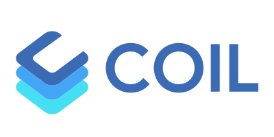



Библиотека для загрузки изображений на Android, работающая с корутинами Kotlin. Coil - это:

- **Скорость**: Coil выполняет оптимизации, включая кэширование в памяти и на диске, уменьшение дискретизации изображения в памяти, автоматическая приостановка/отмена запросов, и многое другое.
- **Маленький вес**: Coil добавляет ~2000 методов в ваш APK (для приложений, уже пользующихся OkHttp и корутинами), что сравнимо с Picasso и гораздо меньше, чем Glide и Fresco.
- **Простота в использовании**: API Coil использует преимущества Kotlin, чтобы уменьшить количество повторяющегося кода.
- **Современность**: Coil в первую очередь предназначен для Kotlin и использует современные библиотеки, включая корутины, OkHttp, Okio, и AndroidX Lifecycles.

Coil - аббревиатура: **Co**routine **I**mage **L**oader (загрузчик изображений при помощи корутин).

## Установка

Coil доступен в `mavenCentral()`.

```kotlin
implementation("io.coil-kt:coil:2.7.0")
```

## Начало работы

#### ImageViews

Чтобы загрузить изображение в `ImageView`, воспользуйтесь расширением `load`:

```kotlin
// URL
imageView.load("https://example.com/image.jpg")

// Файл
imageView.load(File("/path/to/image.jpg"))

// И многое другое...
```

Запросы могут конфигурироваться лямбда-функцией:

```kotlin
imageView.load("https://example.com/image.jpg") {
    crossfade(true)
    placeholder(R.drawable.image)
    transformations(CircleCropTransformation())
}
```

#### Jetpack Compose

Установите библиотеку-расширение для [Jetpack Compose](https://developer.android.com/jetpack/compose):

```kotlin
implementation("io.coil-kt:coil-compose:2.7.0")
```

Чтобы загрузить изображение, воспользуйтесь composable-функцией `AsyncImage`:

```kotlin
AsyncImage(
    model = "https://example.com/image.jpg",
    contentDescription = null,
)
```

#### Загрузчики изображений

Как `imageView.load`, так и `AsyncImage` используют синглтон `ImageLoader` для исполнения запросов на загрузку. Синглтон `ImageLoader` доступен через расширение `Context`:

```kotlin
val imageLoader = context.imageLoader
```

`ImageLoader`ы максимально эффективны, когда во всем приложении используется один и тот же его экземпляр. Тем не менее, вы можете создавать и свои экземпляры `ImageLoader`, если потребуется:

```kotlin
val imageLoader = ImageLoader(context)
```

Если вам не требуется синглтон `ImageLoader`, используйте `io.coil-kt:coil-base` вместо `io.coil-kt:coil`.

#### Запросы

Чтобы загрузить изображение в заданную цель, выполните метод `enqueue` на `ImageRequest`:

```kotlin
val request = ImageRequest.Builder(context)
    .data("https://example.com/image.jpg")
    .target { drawable ->
        // Распоряжайтесь результатом.
    }
    .build()
val disposable = imageLoader.enqueue(request)
```

Чтобы загрузить изображение императивно, выполните `execute` на `ImageRequest`:

```kotlin
val request = ImageRequest.Builder(context)
    .data("https://example.com/image.jpg")
    .build()
val drawable = imageLoader.execute(request).drawable
```

Полную документацию для Coil можно найти [здесь](https://coil-kt.github.io/coil/getting_started/).

## R8 / Proguard

Coil полностью совместим с R8 "из коробки" и не требует дополнительной настройки.

Если вы используете Proguard, вам может понадобиться добавить правила для [корутин](https://github.com/Kotlin/kotlinx.coroutines/blob/master/kotlinx-coroutines-core/jvm/resources/META-INF/proguard/coroutines.pro) и [OkHttp](https://github.com/square/okhttp/blob/master/okhttp/src/main/resources/META-INF/proguard/okhttp3.pro).

## Лицензия

    Copyright 2024 Coil Contributors

    Licensed under the Apache License, Version 2.0 (the "License");
    you may not use this file except in compliance with the License.
    You may obtain a copy of the License at

       https://www.apache.org/licenses/LICENSE-2.0

    Unless required by applicable law or agreed to in writing, software
    distributed under the License is distributed on an "AS IS" BASIS,
    WITHOUT WARRANTIES OR CONDITIONS OF ANY KIND, either express or implied.
    See the License for the specific language governing permissions and
    limitations under the License.
